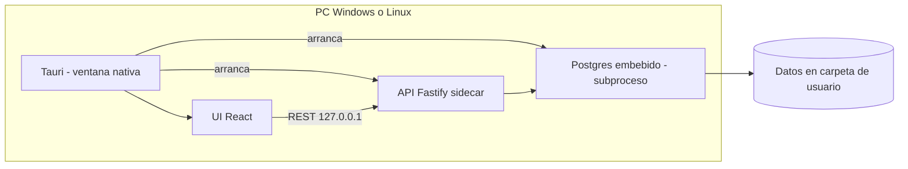

# Arquitectura técnica

> Documento de diseño. **No implica que el código exista aún.**

## Vista general



En **desarrollo**, UI y API pueden correr por separado; conviene usar el mismo modelo de Postgres embebido que producción (ver abajo). En **producción**, Tauri 2 embebe la UI, arranca la API como sidecar y **PostgreSQL como subproceso local** — el usuario no instala Postgres, Docker ni Node por separado.

## Stack propuesto

| Capa | Tecnología | Motivo |
|------|------------|--------|
| UI | React + Vite + TypeScript | Rápido, familiar, reusable patterns de Shopflow |
| Desktop | Tauri 2 (fase 4) | Ventana nativa; instalador por SO (Windows + Linux) |
| API | Fastify + Zod | Alineado con `@multisystem/api`; validación clara |
| ORM | Prisma 7 | Migraciones; mismo camino a Neon que multisystem |
| BD | PostgreSQL 14+ | Requisito explícito; compatible Neon |

## Capas de la API

```
HTTP → Controller → Service → Repository → Prisma
```

- **Controller:** validación de entrada, códigos HTTP, envelope de respuesta.
- **Service:** reglas de negocio (totales, stock, sesión de caja).
- **Repository:** solo acceso a datos.

### Envelope de respuesta (consistente con multisystem)

```json
{
  "success": true,
  "data": {},
  "message": "",
  "code": "OPCIONAL"
}
```

## Autenticación local

- Usuarios en tabla `User` local (no SSO multisystem).
- JWT o sesión firmada con secreto en variables de entorno.
- Token no sale de la máquina.

## PostgreSQL embebido (decisión)

**Decisión:** la app incluye su propio motor PostgreSQL. No se requiere instalación aparte de Postgres, Docker ni servicios del sistema operativo.

| Aspecto | Decisión |
|---------|----------|
| Motor | Binarios PostgreSQL 14+ empaquetados **por plataforma** (Windows x64, Linux x64) |
| Datos | Directorio de usuario de la app (no `Program Files`) |
| Arranque | Tauri/sidecar inicia Postgres como subproceso en `127.0.0.1` (puerto fijo reservado) |
| Primer uso | Si no hay cluster: `initdb` → migraciones Prisma → seed (negocio + admin) |
| Cierre | Al salir la app, apagar Postgres ordenadamente |
| Neon (futuro) | Mismo esquema Prisma; solo cambia `DATABASE_URL` |

### Ubicación de datos

| SO | Ruta |
|----|------|
| Windows | `%LOCALAPPDATA%\Kassio\data\` |
| Linux | `~/.local/share/kassio/data/` |

El cluster (`PGDATA`), logs y backups viven ahí. Desinstalar la app puede ofrecer conservar o borrar esa carpeta.

### Instalación para el usuario final

Un solo artefacto por plataforma; flujo idéntico en Windows y Linux:

```
Instalador (.exe/.msi o .deb/AppImage)
  → Siguiente, Finalizar
  → Icono en escritorio / menú de aplicaciones
  → Primera apertura: "Preparando tu caja…" (initdb + migraciones, ~30–60 s)
  → Pantalla de login
```

**No incluye:** Docker, instalador de PostgreSQL oficial, Node/pnpm, abrir el navegador.

### Contenido del paquete (producción)

```
Kassio/
├── kassio.exe / kassio            ← ventana Tauri (UI)
├── api-server                     ← API Fastify (binario sidecar)
├── resources/ui/                  ← build estático React
└── resources/postgres/            ← binarios del motor (por SO)
```

CI genera builds separados; la lógica de arranque y rutas de datos es la misma.

### Desarrollo

| Enfoque | Cuándo |
|---------|--------|
| **Postgres embebido (recomendado)** | Mismo código de arranque que producción; datos en `~/.local/share/kassio/data/` |
| Postgres del sistema | Opcional, solo comodidad del desarrollador; no es el contrato de producto |

Docker **no** es requisito ni para dev ni para el comercio.

## Offline

Todas las operaciones core leen/escriben PostgreSQL local. No hay llamadas HTTP externas en flujos de venta, compra o catálogo.

## Seguridad

- API enlazada a `127.0.0.1`.
- CORS restringido al origen de la app desktop.
- Sin secretos en el bundle del frontend.

## Impresión (v1 vs v2)

| v1 | v2 |
|----|-----|
| HTML + `window.print()` | ESC/POS vía plugin Tauri o spooler Windows |

## Estructura de repo

```
kassio/
├── docs/
├── apps/desktop/   ← UI React + Vite
├── packages/api/   ← Fastify
└── packages/database/ ← Prisma
```
