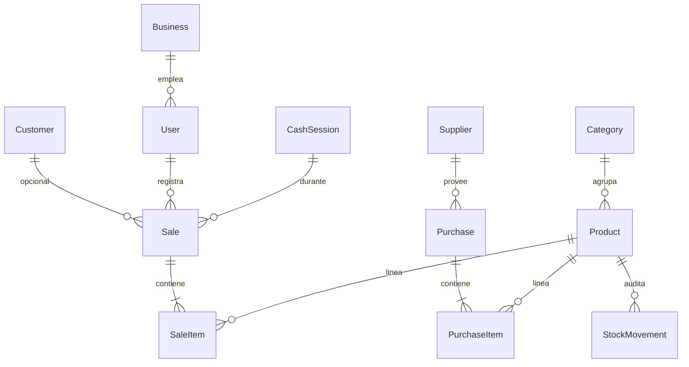

# Modelo de datos

PostgreSQL. Diseño **single-tenant** (un negocio, sin `companyId`).

## Entidades principales

## Tablas

| Entidad | Propósito |
|---------|-----------|
| `Business` | Datos del negocio (nombre, CUIT, dirección, IVA por defecto) — una fila |
| `User` | Cajeros y admin; hash de contraseña; rol |
| `Category` | Agrupación de productos |
| `Product` | Catálogo: precio, costo, SKU, barras, `stockQuantity` |
| `Customer` | Comprador opcional |
| `Supplier` | Proveedor para compras |
| `Purchase` / `PurchaseItem` | Entrada de mercadería |
| `Sale` / `SaleItem` | Venta en mostrador |
| `CashSession` | Turno de caja (apertura/cierre) |
| `StockMovement` | Auditoría: venta, compra, ajuste, anulación |
| `TicketSequence` | Numeración atómica de comprobantes |

## Enums sugeridos

- `UserRole`: `ADMIN`, `CASHIER`
- `PaymentMethod`: `CASH`, `CARD`, `TRANSFER`, `OTHER`
- `SaleStatus`: `COMPLETED`, `VOIDED`, `REFUNDED`
- `CashSessionStatus`: `OPEN`, `CLOSED`
- `StockMovementType`: `SALE`, `PURCHASE`, `ADJUSTMENT`, `VOID`

## Dinero

Usar `DECIMAL(10,2)` en PostgreSQL (Prisma `@db.Decimal(10, 2)`). Misma convención que Shopflow/multisystem.

## Comparación con Shopflow (multisystem)

| Shopflow (nube) | POS local |
|-----------------|-----------|
| `Company` | `Business` (una fila) |
| `companyId` en todas las tablas | Eliminado |
| `Store` + multi-sucursal | Una caja implícita |
| `StoreInventory` | `Product.stockQuantity` en v1 |
| `LoyaltyPoint`, `Invoice` AR | Fuera de v1 |

## Migración futura a Neon

- Provider Prisma: `postgresql` únicamente.
- Evitar extensiones Postgres no soportadas en Neon.
- Migraciones versionadas; en cloud: `prisma migrate deploy` con `DATABASE_URL` de Neon.

Ver [07-FUTURE-INTEGRATION.md](./07-FUTURE-INTEGRATION.md).
