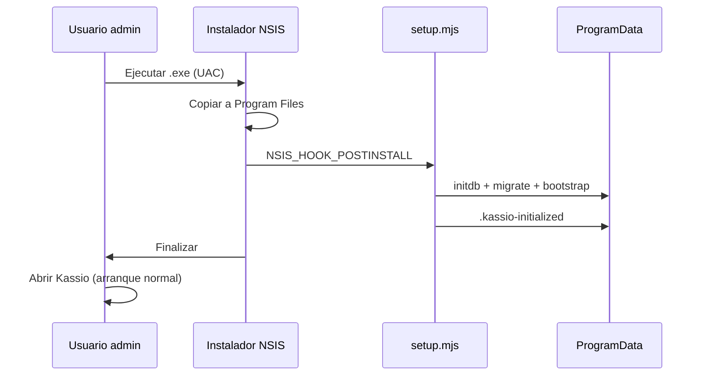
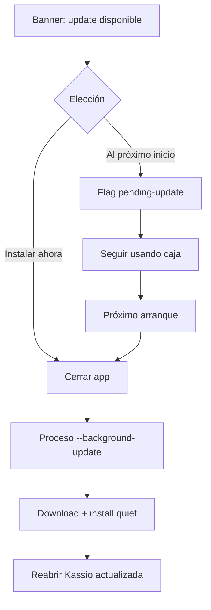

# Instalación y actualización

> Decisiones asentadas para Kassio desktop (Tauri 2). Referencia para implementación, QA y releases.

## Principios

| Principio | Decisión |
|-----------|----------|
| **Autocontenido** | El comercio no instala Node, pnpm, Docker ni PostgreSQL del sistema. Todo va dentro del paquete. |
| **Una caja por PC** | La base de datos es **compartida por todos los usuarios del SO** en esa máquina (no una BD por perfil Windows). |
| **Instalación para todos** | Windows: `perMachine` → `Program Files`. Linux `.deb`: `/usr/lib/Kassio`. |
| **BD en install, no al abrir** | Postgres + migraciones corren en el **hook del instalador**, no en la primera apertura de la app. |
| **Sin demo en producción** | El instalador **no** ejecuta `seed.ts` (negocio/usuarios/productos demo). Solo migraciones + bootstrap técnico (secuencias). |
| **Actualización in-app** | El cajero **no** descarga un `.exe` manualmente. La app avisa, el usuario elige cuándo, y el proceso es en segundo plano. |
| **Datos separados del binario** | Actualizar reemplaza la app; **no** toca la carpeta de datos. |

---

## Artefactos por plataforma

| Plataforma | Instalador | Auto-update |
|------------|--------------|-------------|
| **Windows x64** | `Kassio_*_x64-setup.exe` (NSIS) | Sí (`latest.json` + `.zip` firmado) |
| **Linux x64** | `.deb` | Pendiente (mismo mecanismo Tauri; falta pipeline CI completo) |
| **AppImage** | No recomendado aún | Build roto en CI |

Releases: [github.com/andcast77/kassio/releases](https://github.com/andcast77/kassio/releases)

---

## Ubicaciones en disco

### Windows

| Qué | Ruta |
|-----|------|
| Aplicación (binarios, backend embebido) | `C:\Program Files\Kassio\` |
| Datos (Postgres, marker de init) | `%ProgramData%\Kassio\data\` |
| Flag “actualizar al próximo inicio” | `%ProgramData%\Kassio\pending-update` |

### Linux (`.deb`)

| Qué | Ruta |
|-----|------|
| Aplicación | `/usr/lib/Kassio/` |
| Binario en PATH | `/usr/bin/kassio` |
| Datos compartidos | `/var/lib/kassio/data/` |

### Desarrollo local

| Qué | Ruta |
|-----|------|
| Datos | `~/.local/share/kassio/data/` |

Override para tests: variable `KASSIO_DATA_DIR`.

---

## Contenido del paquete (producción)

Generado por `scripts/stage-backend.mjs` + `tauri build`:

```
Kassio/                          ← Program Files o /usr/lib/Kassio
├── Kassio.exe / kassio          ← shell Tauri (UI)
└── resources/
    ├── node/                    ← Node portable
    ├── backend/                 ← API Fastify (pnpm deploy)
    │   ├── start.mjs            ← arranque normal
    │   ├── setup.mjs            ← hook del instalador
    │   └── prisma/              ← migraciones
    └── install-setup.cmd        ← Windows: invocado por NSIS post-install
```

Postgres embebido y cluster viven bajo la carpeta de **datos**, no dentro de `Program Files`.

---

## Flujo de instalación

### Windows (NSIS)



1. Usuario ejecuta el instalador (**requiere administrador** por `installMode: perMachine`).
2. NSIS copia la app a `Program Files`.
3. Hook post-install ejecuta `install-setup.cmd` → `setup.mjs`:
   - `initdb` (si no hay cluster)
   - `prisma migrate deploy`
   - `install-bootstrap.ts` (secuencias ticket/comprobante; **sin seed demo**)
   - escribe `.kassio-initialized` en la carpeta de datos
4. `icacls` concede permisos de escritura a **Users** sobre `%ProgramData%\Kassio`.
5. Al abrir la app: Tauri arranca `start.mjs` → Postgres + API. **No** repite setup si existe el marker.

### Linux (`.deb`)

1. `dpkg -i` / instalador gráfico (root).
2. `postinst.sh` crea `/var/lib/kassio/data`, corre `setup.mjs` con `KASSIO_DATA_DIR` fijado.
3. Permisos para que cualquier usuario local pueda usar la BD compartida.

### Qué no corre en producción

- `pnpm db:seed` (datos demo: Kassio Demo, cajero@kassio.local, productos de prueba) → **solo desarrollo** (`pnpm db:seed`).

---

## Arranque normal (post-instalación)

```
Kassio.exe
  → spawn resources/node + backend/start.mjs
  → Postgres embebido (127.0.0.1)
  → migrate deploy (si hay migraciones nuevas tras update)
  → API Fastify
  → UI React
```

Si el hook de instalación no corrió (caso raro), `start.mjs` hace fallback one-shot con el mismo bootstrap (sin seed).

---

## Actualización in-app

### Fuente de verdad

- **GitHub Releases** con `latest.json` generado por Tauri (`createUpdaterArtifacts: true`).
- Endpoint configurado en `tauri.conf.json`:
  `https://github.com/andcast77/kassio/releases/latest/download/latest.json`
- Paquetes firmados con minisign; clave pública embebida en la app, privada en CI (`TAURI_SIGNING_PRIVATE_KEY`).

### Experiencia del cajero

1. Al abrir la app (login o caja), se consulta si hay versión nueva.
2. Si hay update → **banner in-app** (no ventana del instalador):
   - **Instalar ahora** → la app **se cierra al instante**
   - **Al próximo inicio** → guarda flag en `%ProgramData%\Kassio\pending-update` y sigue trabajando
3. Un proceso **detached** sin ventana (`Kassio.exe --background-update`):
   - descarga el paquete firmado
   - instala en modo **quiet** (sin asistente NSIS)
   - reinicia Kassio
4. La base en `ProgramData` / `/var/lib/kassio` **no se modifica** (solo binarios).
5. Al abrir la app actualizada, `migrate deploy` aplica schema pendiente si lo hubiera.



### Windows: UAC

Con `perMachine`, la instalación silenciosa del updater puede pedir **UAC un instante** (elevación). No muestra el wizard del instalador.

### Primera versión con updater

Las builds **anteriores a v0.1.3** no tienen el plugin de actualización. Hay que instalar **una vez** la versión que incluye updater; desde ahí, las siguientes son in-app.

---

## Build y release (mantenedores)

### Local (Windows desde Linux)

```bash
node scripts/stage-backend.mjs --target=windows
pnpm --dir apps/desktop tauri:build:windows
# Salida: apps/desktop/src-tauri/target/x86_64-pc-windows-msvc/release/bundle/nsis/
```

Variables para firmar updates:

```bash
export TAURI_SIGNING_PRIVATE_KEY="$(cat .tauri/kassio.key)"
```

### CI

Workflow: `.github/workflows/build-windows-installer.yml`

- Trigger: tag `v*` o `workflow_dispatch`
- Sube a GitHub Release: `.exe`, `.exe.sig`, `.zip` (updater), `.zip.sig`, `latest.json`

### Versionado

Sincronizar versión en:

- `apps/desktop/src-tauri/tauri.conf.json`
- `apps/desktop/src-tauri/Cargo.toml`
- `package.json` (raíz)

Tag git: `v0.1.3` → release `v0.1.3`.

---

## Checklist rápido QA (install / update)

- [ ] Instalación fresh: hook crea BD en `ProgramData`, no en AppData del usuario
- [ ] Segundo usuario Windows ve la **misma** caja (mismos productos/ventas)
- [ ] Reinstalar / update **no** borra datos
- [ ] Update: banner → “Instalar ahora” → app cierra → reabre sola
- [ ] Update: “Al próximo inicio” → cierra sesión, al día siguiente arranca y actualiza sin banner previo
- [ ] Migraciones nuevas se aplican al abrir post-update
- [ ] **No** aparecen productos demo tras install de producción

---

## Pendiente (fuera de alcance actual)

| Tema | Estado |
|------|--------|
| Wizard primer uso (negocio + admin) | No implementado — install deja BD vacía de negocio/usuarios |
| AppImage Linux | Build fallido |
| CI Linux + updater artifacts | Solo Windows en CI hoy |
| Firma de código Windows (SmartScreen) | Instalador unsigned — advertencia al instalar |
| Migración manual AppData → ProgramData | Solo afecta installs v0.1.2 o anteriores |

---

## Referencias en código

| Tema | Archivo |
|------|---------|
| Config Tauri / NSIS / updater | `apps/desktop/src-tauri/tauri.conf.json` |
| Hook NSIS | `apps/desktop/src-tauri/windows/hooks.nsh` |
| Setup install Windows | `apps/desktop/src-tauri/install/install-setup.cmd` |
| postinst Linux | `apps/desktop/src-tauri/install/postinst.sh` |
| Rutas de datos | `packages/runtime/src/paths.ts` |
| Setup install-time | `packages/runtime/src/setup.ts`, `packages/bundle/setup.mjs` |
| Bootstrap sin demo | `packages/database/prisma/install-bootstrap.ts` |
| Seed demo (solo dev) | `packages/database/prisma/seed.ts` |
| Updater UI | `apps/desktop/src/components/UpdateBanner.tsx` |
| Proceso background update | `apps/desktop/src-tauri/src/updater.rs` |
| Stage backend | `scripts/stage-backend.mjs` |
